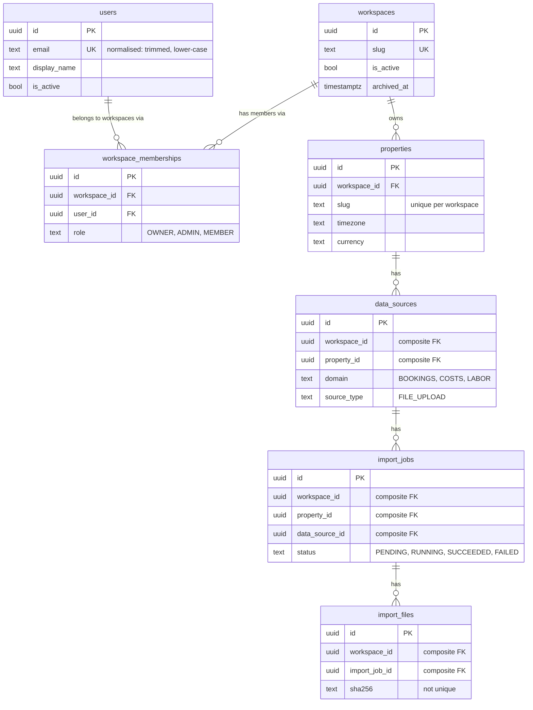
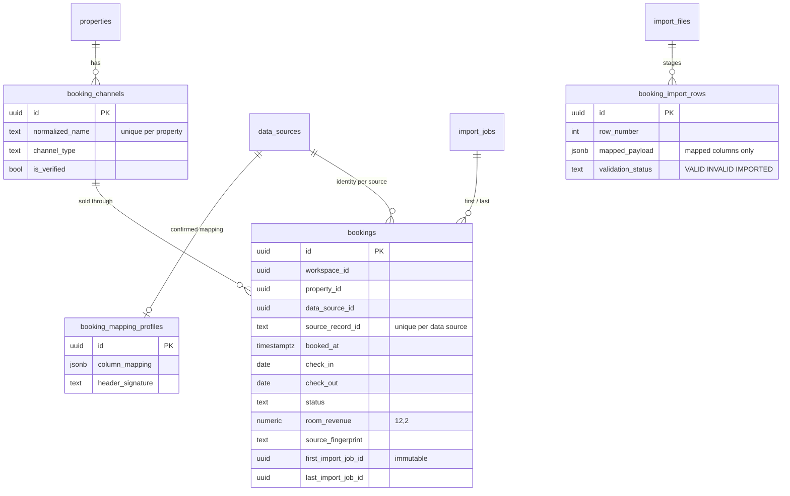
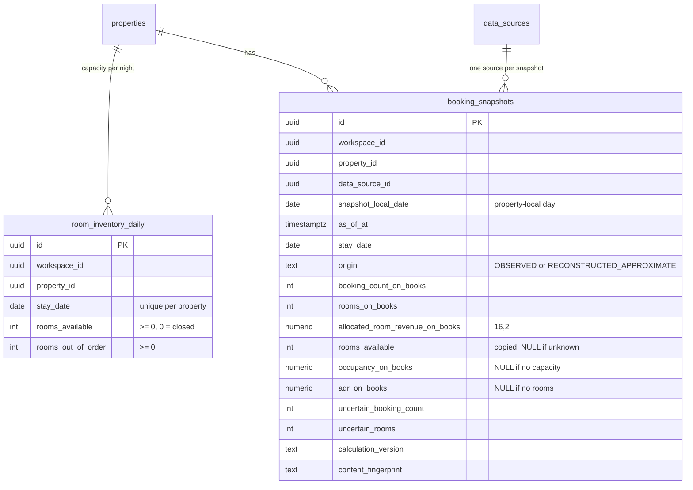

# NINFA — Data model v1 (Gates 1–3)

The canonical multi-tenant core (Gate 1): who the users are, which workspaces (tenants) exist, who
belongs to them, which properties they own, and the metadata skeleton of imports. Gate 2 adds the
canonical bookings (see "Gate 2 additions") and Gate 3 the room inventory and the daily booking
snapshots (see "Gate 3 additions"). **No invoices, suppliers, labor or decisions exist yet.**

Migrations: `0003_canonical_data_model` (Gate 1), `0004_booking_ingestion` (Gate 2) and
`0005_booking_snapshots_metrics` (Gate 3), on top of `0001_baseline`, `0002_procrastinate_schema`.
Code: `services/api/app/modules/{identity,tenancy,properties,ingestion,bookings,snapshots}/`.

## Entity relationships



Access model (enforced later, by the authentication/authorization gate):
`USER → WORKSPACE MEMBERSHIP → PROPERTY ACCESS`. A user may belong to several workspaces; a
workspace owns one or more properties.

## Conventions

| Topic          | Rule |
| -------------- | ---- |
| Identifiers    | UUID v4. Generated by the application (`uuid.uuid4`) and, for raw inserts, by PostgreSQL (`gen_random_uuid()`, built in since PostgreSQL 13; no extension). |
| Timestamps     | `timestamptz`, always UTC: the engine opens every session with `timezone=UTC`. Creation time is a server default (`now()`). |
| Value sets     | Python `StrEnum` stored as `VARCHAR` guarded by a named `CHECK` (not PostgreSQL ENUM types): see ADR 0007. |
| Constraint names | Always explicit and deterministic (`pk_`, `fk_`, `uq_`, `ck_`, `ix_` + table + columns). A test compares them with the ORM metadata. |
| Relationships  | ORM `relationship()` is read-only navigation (`viewonly=True`). Rows are written through repositories, with explicit ids. |

## Entities

**users** — internal identity only; no password, token, session or provider data.
`email` is stored normalised (trimmed, lower-case). Case-insensitive uniqueness needs no extension:
two CHECKs (`email = lower(btrim(email))`, basic format) guarantee only normalised values exist,
so a plain `UNIQUE (email)` is case-insensitive. (`citext` or a `lower(email)` index would also
work but need an extension or discipline in every query.) Deactivated with `is_active`, never deleted.

**workspaces** — the tenant boundary. `slug`: globally unique, `^[a-z0-9]+(-[a-z0-9]+)*$`,
2–63 characters. `is_active` is the operational switch, `archived_at` records archival;
archived implies inactive (CHECK). Archived, never physically deleted. No billing.

**workspace_memberships** — User ↔ Workspace. `UNIQUE (workspace_id, user_id)`; `role` in
`OWNER | ADMIN | MEMBER`. Deleted for real when access is revoked. Not a generic RBAC system.

**properties** — a hospitality structure: identity only (`name`, `slug`, `timezone`, `currency`).
Slug unique *inside* the workspace. Defaults `Europe/Rome` / `EUR`. Archivable. The Property
Profile (rooms, beds, opening model, ...) belongs to the Data Contract gate.

**data_sources** — a logical source of data for one property (`domain` × `source_type`).
No connection exists. Deactivated with `is_active`, never deleted.

**import_jobs** — metadata/lifecycle of a future import. CHECKs keep the lifecycle coherent:
`PENDING` has no timestamps; `RUNNING` has `started_at` and no `finished_at`; `SUCCEEDED`/`FAILED`
have `finished_at`; `finished_at >= started_at`; error fields only when `FAILED`.

**import_files** — metadata of a file attached to a job. `size_bytes >= 0`; `sha256` is 64
lowercase hex characters and deliberately **not** unique (the same content can be imported again).
`storage_key` is a placeholder: no storage exists.

## Tenant integrity (summary; see ADR 0006)

Every tenant-owned row carries an explicit `workspace_id`, and PostgreSQL itself refuses
relationships that cross workspaces, using composite foreign keys:

```
data_sources (workspace_id, property_id)                 → properties  (workspace_id, id)
import_jobs  (workspace_id, property_id, data_source_id) → data_sources (workspace_id, property_id, id)
import_files (workspace_id, import_job_id)               → import_jobs (workspace_id, id)
```

Consequences worth knowing: an import job's `property_id` must be its data source's own
property; child tables have no separate FK to `workspaces` (the chain reaches
`properties.workspace_id → workspaces.id`); the unique constraints on `(workspace_id, id)`-style
column sets exist to be foreign-key targets.

## Delete and archive policy

| Foreign key | On delete | Why |
| ----------- | --------- | --- |
| membership → workspace, membership → user | **CASCADE** | A membership is a pure link, meaningless without either side, and is the one entity really deleted. |
| property → workspace | **RESTRICT** | Workspaces are archived. A workspace that still owns properties can never disappear. |
| data source → property | **RESTRICT** | Same: no silent loss of tenant data by cascade. |
| import job → data source | **RESTRICT** | Operational records are preserved. |
| import file → import job | **RESTRICT** | Operational records are preserved. |

Workspace and property: `archived_at`. Data source and user: `is_active = false`. No delete
endpoints exist. `ON UPDATE` is left at the default (`NO ACTION`): identifiers never change.

## Indexes (only those with a job)

| Index / constraint | Serves |
| ------------------ | ------ |
| `uq_users_email`, `uq_workspaces_slug` | uniqueness and lookup by email / slug |
| `uq_workspace_memberships_workspace_id_user_id` | no duplicates; "members of a workspace" |
| `ix_workspace_memberships_user_id` | "workspaces of a user" (access resolution entry point) |
| `uq_properties_workspace_id_slug` | slug unique per workspace; lookup by slug |
| `uq_properties_workspace_id_id` | target of `data_sources`' composite FK |
| `uq_data_sources_workspace_id_property_id_id` | target of `import_jobs`' composite FK; "sources of a property" |
| `uq_import_jobs_workspace_id_id` | target of `import_files`' composite FK |
| `ix_import_jobs_workspace_id_status` | listing/claiming jobs by state inside a workspace |
| `ix_import_files_workspace_id_import_job_id` | "files of a job"; RESTRICT check on job deletion |
| `ix_import_files_workspace_id_sha256` (partial, non-unique) | future duplicate detection, always inside one workspace |

## Validation: where each rule lives

| Rule | Pydantic | PostgreSQL |
| ---- | :------: | :--------: |
| email normalisation and format | ✓ | ✓ (normalised + format CHECKs) |
| slug format | ✓ | ✓ |
| currency: 3 uppercase letters | ✓ | ✓ |
| currency is a real ISO 4217 code (`app/core/iso4217.py` snapshot) | ✓ | – |
| timezone is a valid IANA identifier (`zoneinfo` + `tzdata`) | ✓ | – (only "not blank") |
| roles, domains, source types, statuses | ✓ | ✓ (CHECK) |
| tenant consistency, uniqueness, lifecycle, sizes | – | ✓ |

The database is the last line of defence; Pydantic gives early, friendly errors and performs
normalisation. Create schemas use `extra="forbid"` and never contain `workspace_id`.

## Application layer

- `TenantContext(workspace_id)` (`app/core/tenant.py`): immutable, no default, not authentication.
- One repository class per entity, in its module. Tenant-owned repositories
  (`MembershipRepository`, `PropertyRepository`, `DataSourceRepository`, `ImportJobRepository`,
  `ImportFileRepository`) take a `TenantContext` at construction and put the `workspace_id` in every
  query; none has a method that accepts a workspace argument. `UserRepository` and
  `WorkspaceRepository` are platform-level (users and the tenant root are not tenant-owned).
- Parents are looked up with the tenant scope before a child is created; a missing or foreign parent
  raises `NotFoundError` (indistinguishable cases). The composite FKs are the backstop.
- Repositories `flush()` but never `commit()`: the caller owns the transaction.

## Gate 2 additions (booking ingestion)

Migration `0004_booking_ingestion`. Full description: [booking-data-v1.md](booking-data-v1.md).



| Table | Tenant integrity (composite FKs, all RESTRICT) | Uniqueness |
| ----- | ---------------------------------------------- | ---------- |
| `booking_channels` | `(workspace, property)` → `properties` | `(workspace, property, normalized_name)`; `(workspace, property, id)` as FK target |
| `booking_mapping_profiles` | `(workspace, property, data_source)` → `data_sources` | `(workspace, data_source)` |
| `bookings` | `(workspace, property, data_source)` → `data_sources`; `(workspace, property, channel)` → `booking_channels`; `(workspace, property, data_source, first/last_import_job)` → `import_jobs` | `(workspace, data_source, source_record_id)` |
| `booking_import_rows` | `(workspace, import_job, import_file)` → `import_files` | `(workspace, import_file, row_number)` |

Changes to Gate 1 tables (only additions): `import_jobs` gets
`UNIQUE (workspace_id, property_id, data_source_id, id)` and `import_files` gets
`UNIQUE (workspace_id, import_job_id, id)`, both as foreign-key targets.

Additional conventions: money `NUMERIC(12,2)` (rates `NUMERIC(7,4)`), JSONB for configuration and
staging (Python `None` is stored as SQL NULL in `normalized_payload`), and a trigger on `bookings`
that refuses changes to its identity columns (`id`, tenant columns, `data_source_id`,
`source_record_id`, `first_import_job_id`, `created_at`).

Indexes added: `ix_bookings_workspace_id_property_id_check_in` (stay-date ranges of a property),
`ix_bookings_workspace_id_property_id_status`, `ix_booking_import_rows_workspace_id_import_job_id`
(rows of a job); the identity/uniqueness constraints above double as lookup indexes. The
`(workspace, property)` and `(workspace, data_source)` access paths of `bookings` are the leading
columns of existing indexes, so no separate index exists for them.

Delete policy: every new foreign key is `RESTRICT` (bookings, channels, mapping and staging are
operational records; nothing is cascaded away).

## Gate 3 additions (room inventory and booking snapshots)

Migration `0005_booking_snapshots_metrics`. Full description:
[booking-snapshots-v1.md](booking-snapshots-v1.md).



| Table | Tenant integrity (composite FKs, all RESTRICT) | Uniqueness |
| ----- | ---------------------------------------------- | ---------- |
| `room_inventory_daily` | `(workspace, property)` → `properties` | `(workspace, property, stay_date)` |
| `booking_snapshots` | `(workspace, property)` → `properties`; `(workspace, property, data_source)` → `data_sources` | `(workspace, data_source, snapshot_local_date, stay_date)` — **no `origin`**: an observation and a reconstruction compete for one slot |

`booking_snapshots` is immutable: no `updated_at` and a `BEFORE UPDATE` trigger that refuses every
update (`DELETE` is not blocked: retention is a later gate). Extra `CHECK`s keep the metrics
consistent (ADR defined ⇔ rooms on the books, occupancy defined ⇔ capacity known and positive, no
uncertainty in an observation, a booking has at least one room). `rooms_total` was not added to
`Property`. No change to Gate 1/2 tables.

Indexes added: `ix_booking_snapshots_booking_curve` `(workspace, data_source, stay_date,
snapshot_local_date)` for the booking curve of one stay night; the unique keys above double as lookup
indexes (the snapshot key's column order also serves "all nights of one snapshot day", so no
separate index exists for it). Delete policy: every new foreign key is `RESTRICT`.

## Not implemented yet

Suppliers, invoices, labor, cost categories, metrics, baselines,
decisions, decision memory; authentication and any tenant-facing API; file upload/storage and the
asynchronous ingestion job; PostgreSQL row-level security (the schema is compatible: every
tenant-owned table has a `workspace_id` column to write policies against).

## Adding a tenant-owned entity (checklist for later gates)

1. Add `workspace_id UUID NOT NULL` (and `property_id` if the row belongs to a property) and a
   composite FK to the parent (`(workspace_id, parent_id) → parent(workspace_id, id)`), adding the unique key on the parent if
   it does not exist. Choose `RESTRICT` unless the row is a pure link.
2. Give every constraint and index an explicit name; write the migration by hand.
3. Add a repository that takes a `TenantContext`; every query filters on `workspace_id`.
4. Add a cross-tenant DB test next to those in `tests/test_tenant_integrity.py`.
